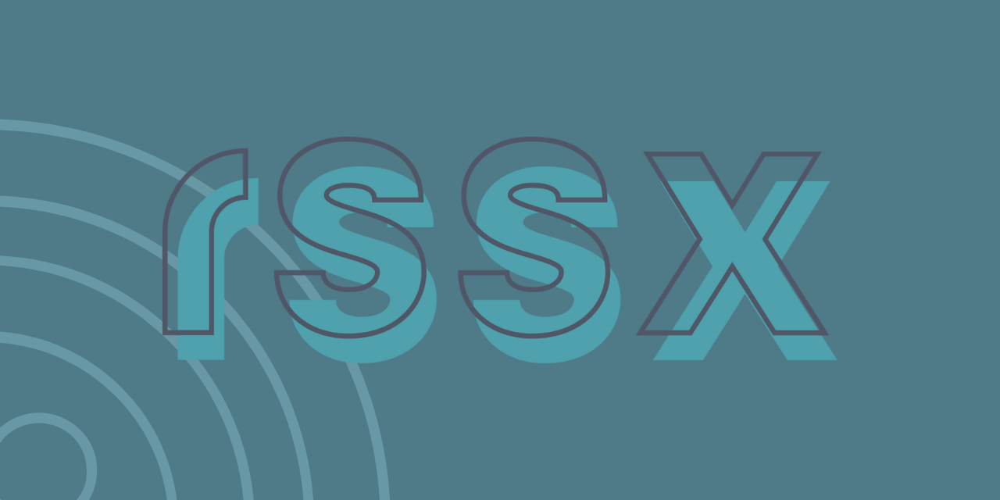

# RSSX

<p align="center">
</p>
<p align="p">A minimalistic RSS reader</p>

## Features

- ☁️ Add Sources
- ✅ Mark articles as read/unread
- 🕦 Mark articles as read later
- ✨ Automatically fetches new articles
- 🔎 Search for articles

## WIP

- Settings for the interval to update articles
- Database settings on how old articles must be to be deleted
- Delete everything button
- Export everything button
- Add video tab to add videos to watch later

## Built With

- NextJS
- Tailwind
- Prisma
- [tRPC](https://trpc.io)
- Postgres

## Local Development

```bash
yarn clone git@github.com:SaraVieira/rssx.git
cd rssx
yarn
yarn dx
```

> Node > 14 and docker are required to run the app

## Deployment

### Using [Render](https://render.com/)

The project contains a [`render.yaml`](./render.yaml) [_"Blueprint"_](https://render.com/docs/blueprint-spec) which makes the project easily deployable on [Render](https://render.com/).

Go to [dashboard.render.com/blueprints](https://dashboard.render.com/blueprints) and connect to this Blueprint and see how the app and database automatically gets deployed.
